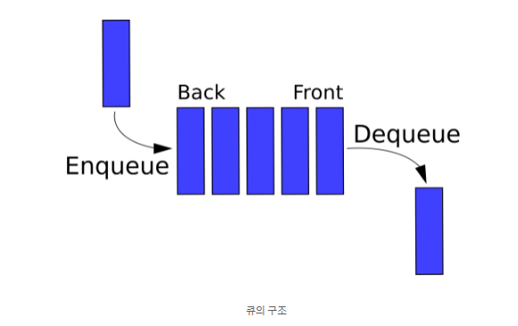
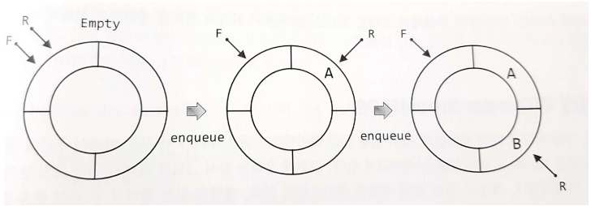
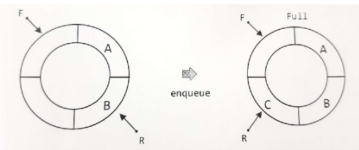
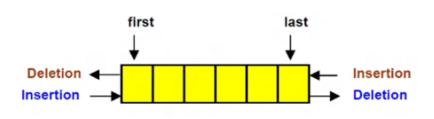

# Queue와 Deque(Double Ended Queue)
- 스택과 함께 언급되고, 비교되는 자료구조

- **스택**이 LIFO로 먼저 들어간 데이터가 나중에 나오는 구조인 반면, **큐**는 **FIFO**(First in, First out)로 **먼저 들어간 데이터가 먼저 나오는 구조**이다


    


<br>

스택에서는 가장 최근 데이터의 위치를 확인하기 위해 ```top```변수를 사용하였다면, 큐에서는 입구와 출구가 따로 있기 때문에 앞과 뒤를 의미하는 ```front```(삭제 연산만 이뤄지는 곳), ```rear```(삽입 연산만 이뤄지는 곳)를 사용한다

<br>

## 큐의 핵심 연산
1. ```endqueue(x)``` : **큐에 데이터를 넣는 연산(큐의 rear에서 이뤄지는 삽입 연산)**. 주어진 요소 x를 큐의 맨뒤에 추가한다. 
2. ```dequeue()``` : 큐가 비어있지 않으면 맨앞에 있는 요소를 삭제하고 반환한다. **(큐의 front에서 이뤄지는 삭제 연산)**

<br>

## 큐의 구현과 단점
스택과 마찬가지로 배열과 연결리스트로 구현할 수 있는데 스택과 같이 단지 일직선으로 큐를 구현하려 한다면 먼저 구조를 고민해야 한다. 

만약 큐에 데이터가 꽉 찬다면 데이터를 더 추가할 수 없다.
두번째로 공간의 효율성에 문제가 발생한다. 배열로 단순히 구현하면 ```endqueue```를 반복하여 데이터를 삽입 후, ```dequeue```를 반복하여 삭제한다면 ```front```가 계속 뒤로 밀려 앞에 공간이 남게 된다. 즉, 하나의 원소가 빠져서 공간이 비게 되면 그 다음부터 남아있는 모든 데이터를 앞으로 당겨야해 비효율적이다. 

<br>

## 원형 큐(Circular Queue)

선형 큐의 단점을 보완 할 수 있다. 배열로 구현을 하지만 실제 작동은 원형으로 되어 있는 것처럼 자료구조를 사용한다.

선형큐와 **front**, **rear**은 같다. 그러나, **front는** *첫번째 요소 하나 앞의 인덱스*를 가리키는 반면 **rear**은 *마지막 요소*를 가리키고 있다.



<br>

- **enqueue 연산 시**

    R이 가리키는 위치를 한 칸 이동시킨 다음에, R이 가리키는 위치에 데이터를 저장한다.

- **dequeue 연산 시**

    F가 가리키는 위치를 한 칸 이동시킨 다음에, F가 가리키는 위치에 저장된 데이터를 반환/삭제한다.

- **circular queue가 포화 상태일 때**

    처음에는 front와 rear가 같은 곳을 가리키고 있지만, 포화 상태일 때는 front와 rear는 한칸 차이가 난다. 

    포화 상태일때도 모은 공간을 사용하게 된다면 front와 rear가 같은 곳을 가리키게 되는데 그렇게 되면 공백상태와 포화상태가 구분이 가지 않는다. 따라서, 한칸을 띄워 놓는다.

    

<br><br>

## Deque(덱)
**앞뒤 모두에서 입력과 출력이 가능한 형태**

실제로 양쪽의 입력과 출력을 모두 사용하는 경우는 없고, 보통 입력을 추가하거나 출력을 추가하는 방식으로 많이 사용한다.
**즉, 큐를 구현 시 양쪽에서 출력이 가능해야하거나, 스택 구현 시 양쪽에서 입력해야할 때 사용한다.**



<br>

## 덱의 연산

1. ```addFront(e)``` : 주어진 요소 e를 덱의 맨 앞에 추가
2. ```deleteRear()``` : 덱이 비어있지 않으면, 맨뒤에 있는 요소를 삭제하고 반환
3. ```getFront/Rear()``` : 덱이 비어 있지 않으면, 맨 앞/맨 뒤에 있는 요소를 삭제하지 않고 반환

<br>

## 파이썬에서의 큐 구현

1. collection 모듈의 **```deque``` 객체** 활용

    큐는 스택과 같이 리스트로 구현 가능하다. 그러나 리스트로 사용시 ```pop(0)```은 시간복잡도 O(N)을 가지고, ```popleft()```은 시간복잡도 O(1)을 가지므로 ```popleft()```를 사용하는 것이 더 효율적이기 때문에 ```deque```를 사용한다.

    - 시간복잡도 : O(1) 
    
    <br>

    ```python
    from collections import deque

    # 5 삽입 > 2 삽입 > 3 삽입 > 7 삽입 > 삭제 > 1 삽입 > 4 삽입 > 삭제 순으로 구현

    queue = deque()

    queue.append(5)
    queue.append(2)
    queue.append(3)
    queue.append(7)
    queue.popleft()     # 제일 먼저 들어간 값 5 삭제

    queue.append(1)
    queue.append(4)
    queue.popleft()     # 그 다음 먼저 들어간 값 2 삭제

    print(queue)  # deque([3, 7, 1, 4]) : 먼저 들어간 순으로 출력
    print(queue.reverse())    # 나중에 입력된 데이터순으로 출력
    ```

<br>

## 큐의 활용 예시
큐는 주로 데이터가 입력된 시간 순서대로 처리해야할 필요가 있는 상황에 이용
1. 우선순위가 같은 작업 예약(프린터의 인쇄 대기열)
2. 은행 업무
3. 콜센터 고객 대기시간
4. 프로세스 관리
5. 너비 우선 탐색(BFS) 구현
6. 캐시(Cache) 구현

<br><br>

---
[출처](https://nul-problg.tistory.com/20?category=843875)