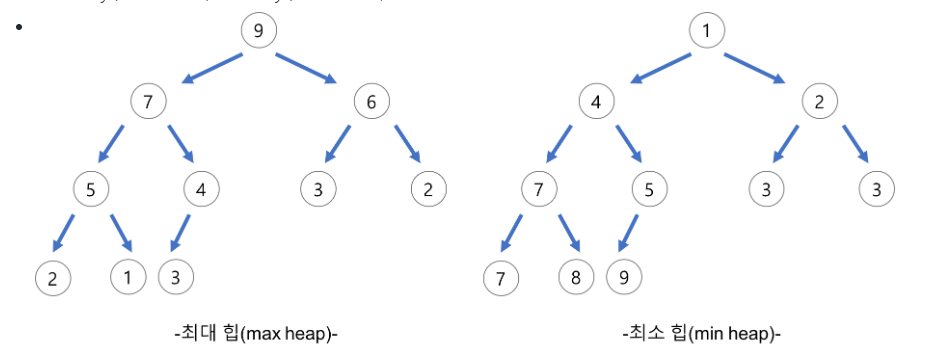
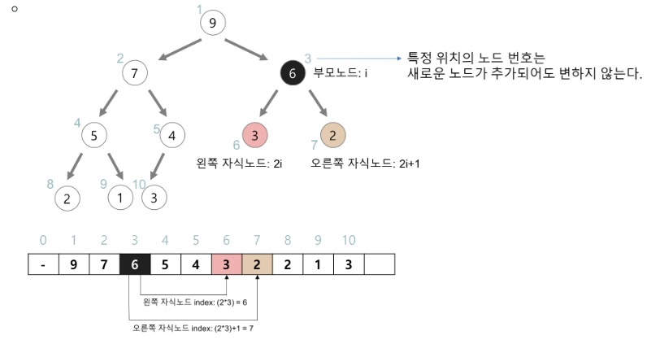
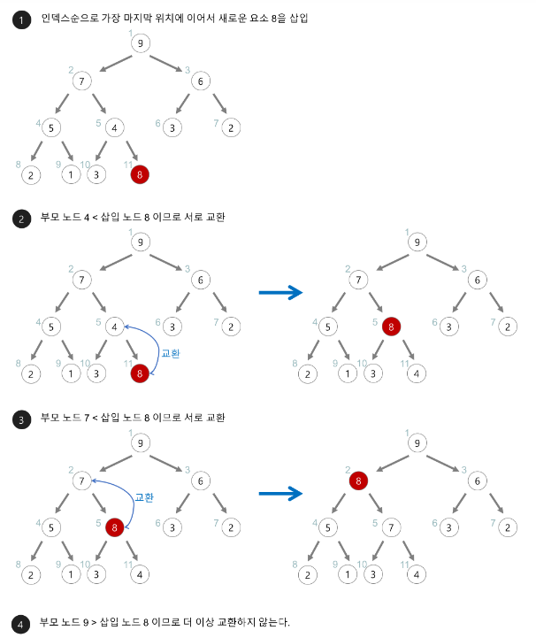
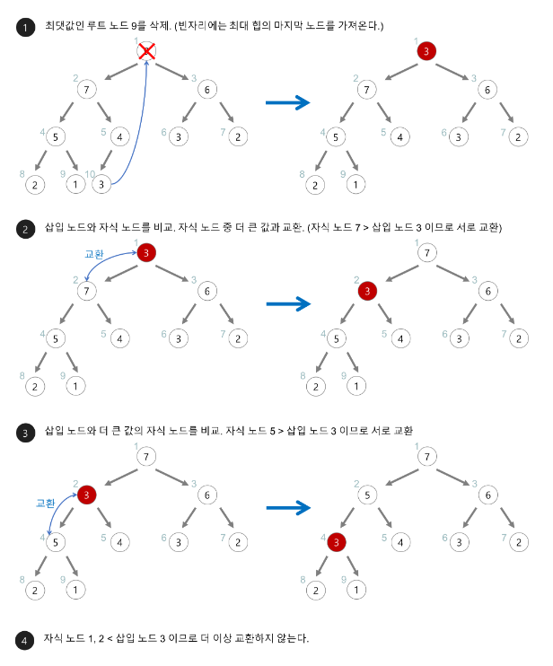

# 힙
우선 순위 큐를 위해 만들어진 자료구조


## 우선 순위 큐란?
우선순위의 개념을 큐에 도입한 자료구조

|자료구조|삭제되는 요소|
|-------|-------------|
|스택(Stack)|가장 최근에 들어온 데이터|
|큐(Queue)|가장 먼저 들어온 데이터|
|우선순위 큐(Priority Queue)|가장 우선순위가 높은 데이터|

<BR>

### 우선순위 큐의 이용 사례
1. 시뮬레이션 시스템
2. 네트워크 트래픽 제어
1. 운영체제에서의 작업 스케쥴링
1. 수치 해석적인 계산

<br>

## 우선순위 큐의 구현
- 배열, 연결리스트, 힙으로 구현이 가능
- 힙으로 구현하는 것이 가장 효율적이다

|우선순위 큐 구현 방법| 삽입 | 삭제 |
|--------------------|------|-----|
|순서 없는 배열| O(1)|O(n)|
|순서 없는 연결 리스트|O(1)|O(n)|
|정렬된 배열|O(n)|O(1)|
|정렬된 연결 리스트|O(n)|O(1)|
|**힙**|O(logn)|O(logn)|

<br><Br>

## 자료구조 '힙(Heap)'이란?
- 완전 이진트리의 일종으로 우선순위 큐를 위해 만들어진 자료구조
- 여러 개의 값 중 최대값이나 최소값을 빠르게 찾아내도록 만들어진 자료구조
- 힙은 일종의 **반정렬 상태(느슨한 정렬 상태)** 를 유지

    - 큰 값이 상위 레벨, 작은 값이 하위 레벨에 있다 정도
    - 부모 노드의 키 값이 자식 노드의 키 값보다 항상 큰(작은) 이진 트리
- 힙 트리에서는 중복 값 허용(이진 탐색 트리에서는 중복 값 허용X)

<br>

## 힙(heap)의 종류
1. **최대 힙(max heap)**
    - 부모 노드의 키 값이 자식 노드의 키 값보다 크거나 같은 완전 이진 트리
    - ```key(부모노트) >= key(자식 노드)```

2. **최소 힙(min heap)**
    - 부모 노드의 키 값이 자식 노드의 키 값보다 작거나 같은 완전 이진 트리
    - ```key(부모 노드) <= key(자식 노드)```
    <br>
    <Br>
    

<br>

## 힙의 구현
- 힙을 저장하는 표준적인 자료구조는 **배열**
- 구현을 쉽게 하기 위해 배열의 첫번째 인덱스인 0은 사용되지 않는다
- 특정 위치의 노드 번호는 새로운 노드가 추가되어도 변하지 않는다.
    - ex) root 노드의 오른쪽 노드 번호는 항상 3이다
<br>

### 힙에서의 부모 노드와 자식 노드의 관계
- 왼쪽 자식의 인덱스 = (부모의 인덱스)*2
- 오른쪽 자식의 인덱스 = (부모의 인덱스)*2 + 1
- 부모의 인덱스 = (자식의 인덱스)/2
<br><Br>

    

<br>


## 힙의 삽입
- 힙의 새로운 요소가 들어오면 새로운 노드를 힙의 마지막 노드에 이어서 삽입
- 새로운 노드를 부모 노드들과 교환해 힙의 성질을 만족시킨다

    

<Br>

## 힙의 삭제
- 최대 힙에서 최대값은 루트 노드이므로 루트 노드가 삭제된다
    - 최대 힙(max heap)에서 삭제 연산은 최대값을 가지는 요소를 삭제하는 것
- 삭제된 루트 노드에는 힙의 마지막 노드를 가져온다
- 힙을 재구성 한다

    

<br><Br>

## 파이썬에서의 Heap 구현
파이썬의 ```heapq``` 모듈 사용한다

- 우선순위 큐(Priority Queue) 알고리즘을 제공

- 파이썬의 리스트를 사용해 인덱스 0부터 시작해 k번째 원소가 항상 자식 원소(2k+1, 2k+2)보다 작거나 같은 최소 힙의 형태로 정렬

<br>

### **힙 생성**

파이썬의 리스트를 최소 힙 형태로 정렬하기 때문에 빈 리스트를 생성한 뒤, 모듈 함수를 호출할 때마다 생성한 리스트를 인자 값으로 넘겨야 한다
- 추가/삭제만 해도 알아서 정렬해줌

```python
import heapq
heap = []
```

### **힙 삽입하기**
```heappush()``` 함수 사용
- 첫번째 인자로는 대상 리스트를 두번째 인자로는 삽입할 값을 전달

```python
heapq.heappush(heap, 10)
heapq.heappush(heap, 6)
heapq.heappush(heap, 13)
heapq.heappush(heap, 5)

print(heap)   # [5, 6, 13, 10]
```

### **힙 삭제하기**
```heappop()``` 함수 사용
- 최소값을 삭제한 뒤에 반환
```python
print(heapq.heappop(heap))   # 5
print(heap)    # [6, 13, 10]
```

- 삭제하지 않고 최소값을 출력하려면
```python
print(heap[0])       # 6
```
<br>

## 최소 힙은 최솟값을 빠르게 찾기 위한 알고리즘
작은 순서대로 정렬하는 알고리즘이 아니다. 따라서, heap[1]은 두번째로 작은 원소가 들어있지 않다


<br>

### **리스트를 힙으로 변환하기**
```heapify()``` 함수 사용
```python
heap = [7, 2, 4, 3, 1]
heapq.heapify(heap)

print(heap)     # [1, 2, 4, 3, 7]
```

<Br><Br>
-----------------
[파이썬으로 힙 구현](https://daimhada.tistory.com/108)